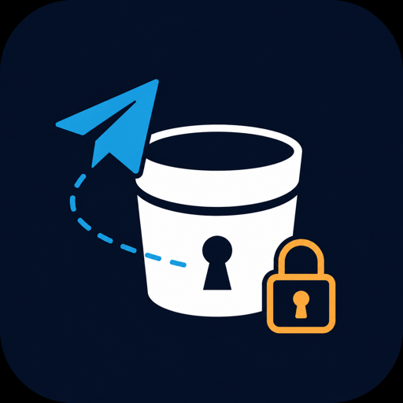

<p align="center">
  
</p>

# Telang

**Docs site:** [Home and reference](https://chud-lori.github.io/telang/)
and [Setup & usage](https://chud-lori.github.io/telang/setup/), built
from [`docs/`](docs/) via GitHub Pages. The home page carries the command,
configuration and S3-operation reference. Architecture notes for
contributors live in [`ARCHITECTURE.md`](ARCHITECTURE.md), and the design
direction for the site is in [`DESIGN.md`](DESIGN.md).

**Free, effectively-unlimited object storage you self-host, using a
private Telegram channel as the actual disk.** Run a single binary on
your own box with your own Telegram credentials; the bytes live as
encrypted messages inside Telegram. Telang speaks the standard S3 wire
protocol on the front, so anything that already talks to S3 (`aws s3`,
`rclone`, `boto3`, Cyberduck, aws-sdk-go-v2, …) Just Works against
`http://localhost:9000`. No Telang-specific client needed.

Good for hobby projects, internal tools, and dev / staging. **Not for
production, customer data, or high-throughput public asset serving.**
Telegram can ban the account; your data can vanish. That is the deal.

## What it does

- Speaks the AWS S3 wire protocol, including Signature V4, unsigned and
  streaming payloads, single-range GET, ListObjectsV2 with prefix +
  delimiter + pagination, and multipart upload.
- Encrypts every object with **AES-256-GCM** in 64 KiB frames before
  uploading; Telegram only ever sees ciphertext.
- Uses a per-bucket key stored in a `keys.toml` file with chmod 600.
  Losing the file means losing the data, so back it up out of band.
- Two storage modes: **bot** (Telegram Bot API, 20 MiB per object,
  no phone number needed) and **mtproto** (Telegram user-account
  session, 2000 MiB per object). Multipart upload does not raise either
  ceiling: the completed object is still one Telegram message.
- Disk LRU cache so warm reads don't round-trip to Telegram.

## What it does not do

- Versioning, ACLs, CORS, lifecycle, replication, object lock, tagging.
- SSE-C / SSE-KMS server-side encryption variants.
- Multi-tenant credentials. One static access-key / secret-key pair per
  install. Put a reverse proxy in front if you need more.
- Act as a CDN. Telegram is not a CDN.

## Quick install

There are no tagged releases and no published binaries yet, so build from
a clone. Go 1.25 or newer is required.

```bash
git clone https://github.com/chud-lori/telang
cd telang
go build -o telang ./cmd/telang

./telang init --config ./config.toml --keys ./keys.toml --data-dir ./var
./telang serve --config ./config.toml
```

`go install` does not work yet: `go.mod` declares the module path
`github.com/telang/telang` while the repository lives at
`github.com/chud-lori/telang`, so neither spelling resolves. A container
image is not published either, but `docker build -t telang:local .` from
the clone builds one.

See [setup.md](setup.md) for the long version: choosing a mode,
registering credentials, and configuring `aws-cli` / `rclone` /
Cyberduck against the daemon.

## Using it

Once `telang serve` is running, point any S3 SDK at
`http://localhost:9000` and use the credentials `telang init` printed.
No Telang-specific client to install.

```go
// Go, with aws-sdk-go-v2
cfg, _ := config.LoadDefaultConfig(ctx,
    config.WithRegion("tg-1"),
    config.WithCredentialsProvider(credentials.NewStaticCredentialsProvider(
        "AKIA...", "...", "", // from `telang init`
    )),
    config.WithBaseEndpoint("http://localhost:9000"),
)
c := s3.NewFromConfig(cfg, func(o *s3.Options) { o.UsePathStyle = true })

_, _ = c.PutObject(ctx, &s3.PutObjectInput{
    Bucket: aws.String("photos"),
    Key:    aws.String("holiday.jpg"),
    Body:   bytes.NewReader(data),
})
```

```python
# Python, with boto3
import boto3
from botocore.config import Config

s3 = boto3.client(
    "s3",
    endpoint_url="http://localhost:9000",
    aws_access_key_id="AKIA...",   # from `telang init`
    aws_secret_access_key="...",    # from `telang init`
    region_name="tg-1",
    config=Config(signature_version="s3v4", s3={"addressing_style": "path"}),
)

s3.put_object(Bucket="photos", Key="holiday.jpg", Body=data)
```

The aws-cli, rclone (including `rclone mount`), Cyberduck, and
aws-sdk-js-v3 also work without any extra glue. Full lifecycle
examples (create → put → head → get → range → list → presigned →
delete) and the rclone/Cyberduck config are in [setup.md](setup.md).

## Commands

| Command | Purpose |
|---|---|
| `telang init` | interactive setup (mode, credentials, channel, S3 keys) |
| `telang serve --config PATH` | run the daemon |
| `telang reauth` | re-login when an MTProto session expires |
| `telang fsck [--fix]` | report index rows whose Telegram message is gone, and with `--fix` delete them |
| `telang export-metadata > meta.jsonl` | dump the object index as JSONL |
| `telang import-metadata < meta.jsonl` | read that dump back, the recovery path after a lost index |

Every command takes `--config`, which defaults to
`/etc/telang/config.toml`. Full flag and configuration-key reference:
<https://chud-lori.github.io/telang/>.

## Files Telang owns

| File | What |
|---|---|
| `config.toml` | server, S3, Telegram mode, paths |
| `keys.toml` | per-bucket AES keys. Back this up |
| `telang.db` | SQLite index of buckets, objects, multipart state |
| `cache/` | LRU ciphertext cache |
| `staging/` | tmp dirs for in-flight multipart uploads |
| `session` (mtproto mode only) | gotd/td session blob |

## Risks worth re-reading

1. **Account ban.** Telegram tolerates this kind of usage at small scale
   (rclone's Telegram backend, TgFileStream, etc. all operate this way)
   but does not promise to. If they ban the account, every object becomes
   unreadable until you `telang export-metadata`, log into a fresh
   account, re-fetch the files, and import. That is the existential risk
   and it is why this is not for production.
2. **`keys.toml` loss.** No keys, no plaintext. Telang refuses to start
   if the file isn't chmod 600. Back it up.
3. **Throughput.** Telegram rate-limits the kinds of operations Telang
   makes. The daemon waits out a 429 and backs off on transient 5xx, but
   once the retries are spent the request answers `503 SlowDown`, and a
   streaming upload cannot be retried at all. Use this for hobby
   workloads.

## License

MIT. See `LICENSE` (rationale: maximum compatibility for embed / fork
use cases; matches `rclone`).
